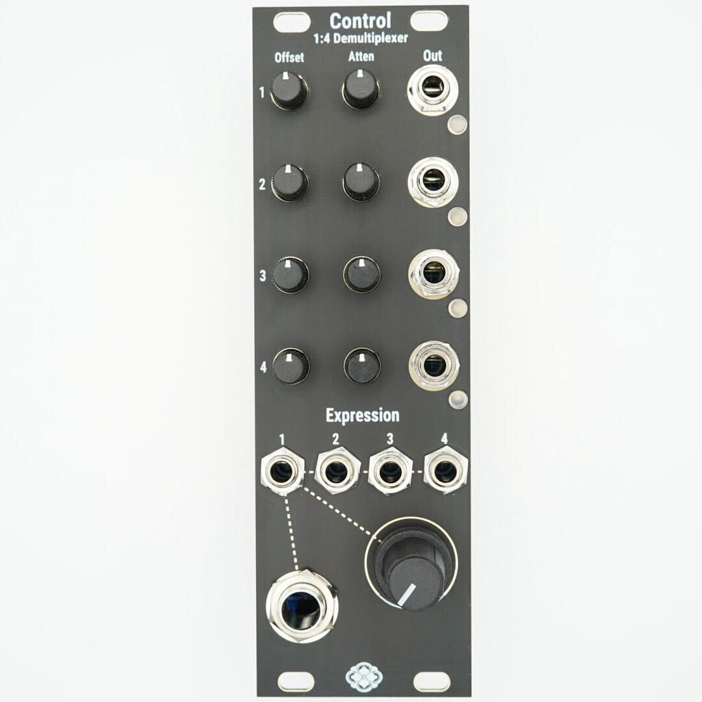
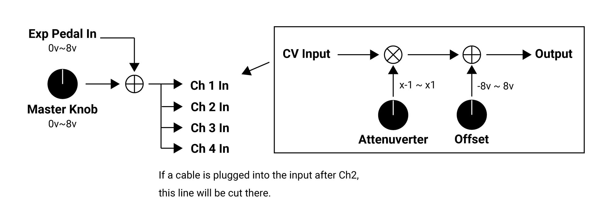

# Control
**Control**is a 4 channels of Offset/Attenuverter.

It supports the connection of an **Expression pedal**, enabling foot-operated performance within a Eurorack system.

   

# Diagram
    

If no cables are connected to the CV input of each channel, the signal from the Master Knob and EXP Pedal In will be applied to all channels. However, if an external CV is connected to Ch2 or later channels, the external CV will override the internal connection starting from that point.

Example:
If an external CV is connected to the input of Ch3, the Master Knob and EXP Pedal In signals will be applied to Ch1 and Ch2, while the CV connected to Ch3 will be applied to Ch3 and Ch4.

# Control's controls
### Master Knob
Sets an offset of 0V to 8V. This signal is shared across all channels if no cables are connected to inputs 2 and beyond.

### EXP in
An expression pedal, such as those used with guitar effects, can be connected. It outputs 0V to 8V.
Supports standard TRS-connected expression pedals and allows polarity switching via the rear switch for the following configurations:

・CW-Sleeve / Wiper-Tip / CCW-Ring  
・CW-Sleeve / Wiper-Ring / CCW-Tip

The module was developed using the M-AUDIO EX-P.

### Attenuverner  
Amplifies or attenuates the input signal within a range of -1x to +1x.

### Offset
Adds an offset voltage of -8V to +8V.

Both the Offset and Attenuverter knobs feature center detents; however, due to the nature of the analog circuitry, the center position does not guarantee an exact zero.

# Compatible Devices
- M-Audio EX-P
 
# Specification
Width : 8HP  
Max Depth: 30mm  
Maximum current draw:
* 82mA @12V
* 71mA @-12V

<a href="https://modulargrid.net/e/sdkc-instruments-control">Modular Grid</a>

#  Warranty

Sdkc Instruments provides a one-year warranty for this product, ensuring it is free from defects in materials and construction from the date of purchase (proof of purchase/invoice required).

Malfunctions caused by incorrect power supply voltages, backward or reversed Eurorack bus board cable connections, misuse of the product, removing knobs, changing faceplates, unauthorized modifications (including unofficial firmware updates), or any other causes determined by Sdkc Instruments to be the fault of the user are not covered by this warranty, and normal service rates will apply.

Damage caused by exposure to extreme environmental conditions (such as excessive heat, moisture, or humidity) is also not covered by this warranty.

For warranty service, please contact the retailer where you purchased the product. In the case of a defect covered by this warranty, Sdkc Instruments will repair or replace the product. 

Sdkc Instruments shall not be liable for any injury to persons or damage to property resulting from the use or misuse of this product. For any questions, please contact sdkc.store[a]gmail.com or your dealer.

# Contact
Please contact support at the following address. Replace "a" with "@" in the address.

sdkc.store[a]gmail.com