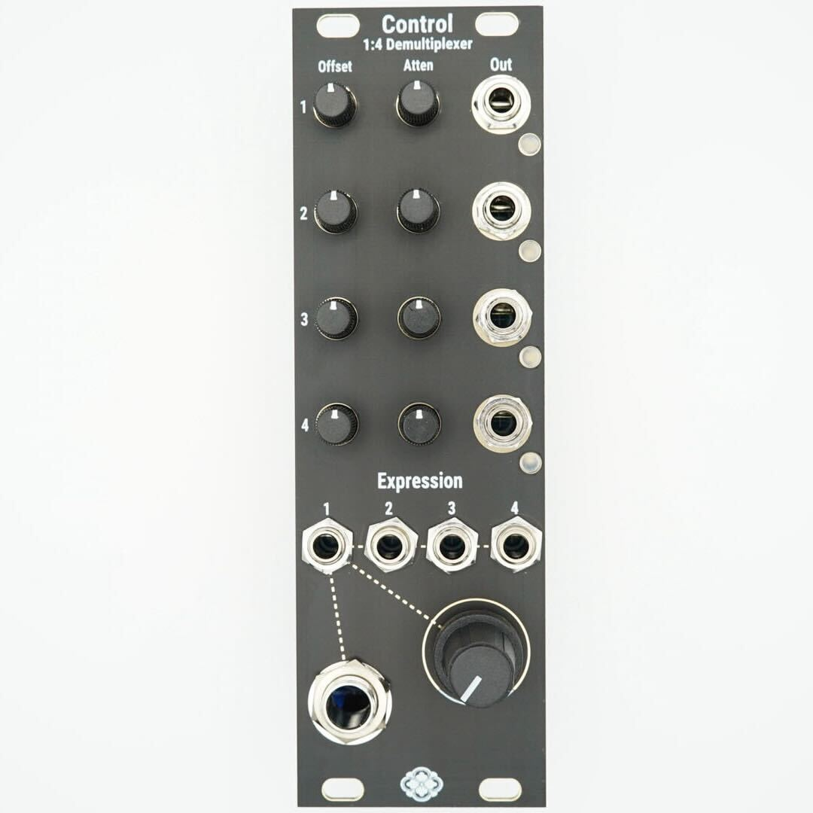
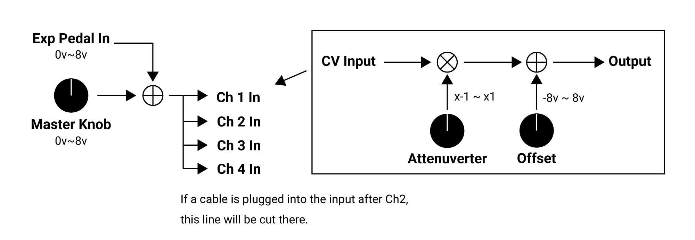

# Control
**Control**は、4チャンネルのOffset/Attenuverterを備えたモジュールです。

Expressionペダルの接続に対応しており、Eurorackシステムでの演奏に足を使った操作を加えることができます。

   

# Diagram
    

各チャンネルのCVインプットに何も接続されていない場合、Master KnobとEXP Pedal Inの信号がすべてのチャンネルに適用されます。ただし、Ch2以降に外部CVを接続すると、そのポイント以降のチャンネルには外部CVが接続されます。

例) Ch3の入力に外部からCVを接続した場合、Ch1とCh2にはMaster KnobとEXPinのCVが接続され、Ch3とCh4にはCh3に入力したCVが接続されます。

# Control's controls
### Master Knob
0V～8Vのオフセットを設定します。この信号は、2番以降の入力に何も接続されていない場合、すべてのチャンネルで共有されます。

### EXP in
ギターエフェクターなどで使われる、Expressionペダルを接続する事ができます。0V-8Vを出力します。  
一般的なTRS接続のExpressionペダルに対応しています。以下の極性に対応しており、裏面のスイッチで切り替えることが可能です

注)ロットによりステレオジャックの極性が異なる為、接続時の挙動がおかしい場合はスイッチを反転してください。
どのバージョンでも下記接続の切り替えが可能ですので、ご使用には問題ありません。

・CW-Sleeve / Wiper-Tip / CCW-Ring  
・CW-Sleeve / Wiper-Ring / CCW-Tip

開発はM-AUDIOのEX-Pを使用しております。

### Attenuverner  
入力された信号を-1倍から+1倍の範囲で増幅・減衰させます。

### Offset
-8V~+8Vのオフセット電圧を加えます。

OffsetとAttenuverterノブにはセンタークリックがありますが、アナログ回路の特性上、センター位置が完全な0を示すわけではありません。

# Compatible Devices
- M-Audio EX-P

# Specification
Width : 8HP  
Max Depth: 30mm  
Maximum current draw:
* 82mA @12V
* 72mA @-12V

<a href="https://modulargrid.net/e/sdkc-instruments-control">Modular Grid</a>

# Warranty

Sdkc Instrumentsは、本製品の購入日から1年間、材料および製造上の欠陥がないことを保証します（購入証明書や領収書が必要です）。

不適切な電源電圧、Eurorackバスボードケーブルの逆接続、製品の誤使用、ノブの取り外し、フェイスプレートの交換、非公式のファームウェア更新を含む許可されていない改造、その他Sdkc Instrumentsがユーザーの責任と判断した原因による不具合は保証対象外となり、その場合は通常の修理料金が適用されます。

また、過度な高温や湿気などの極端な環境条件による損傷も保証対象外となります。

保証サービスが必要な場合は、購入された販売店にお問い合わせください。保証対象となる不具合が確認された場合、Sdkc Instrumentsは製品の修理または交換を行います。

本製品の使用や誤使用によって生じた人身事故や物的損害について、Sdkc Instrumentsは一切の責任を負いません。ご不明点がある場合は、sdkc.store[a]gmail.com またはお近くの販売店までお問い合わせください。

# Contact
下記のアドレスにご連絡ください。[a]を@に置き換えてください。

sdkc.store[a]gmail.com